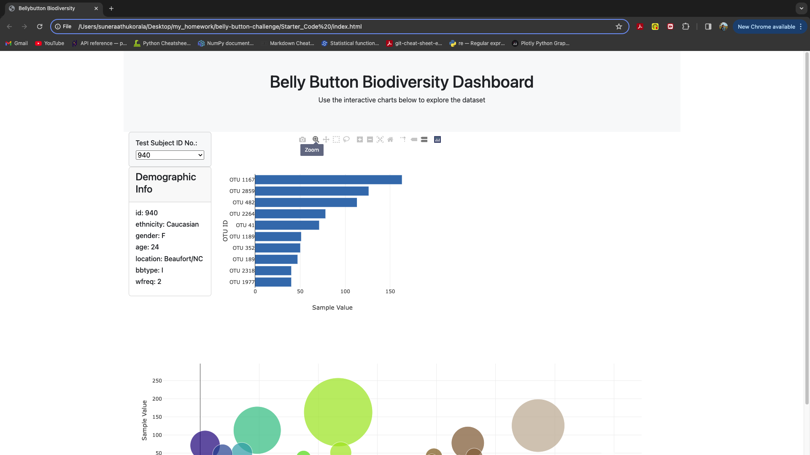

# Belly Button Challenge
The dataset reveals that a small handful of microbial species (also called operational taxonomic units, or OTUs, in the study) were present in more than 70% of people, while the rest were relatively rare.

In this challenge I have created a horizontal bar chart with a dropdown menu to display the top 10 OTUs found in that individual, a bubble chart that displays each sample and a tab to display the sample metadata, i.e., an individual's demographic information.

I have attachecd a screenshot of Belly Button Dashbard,

## Resources
1. I have utilized Plotly.js library to create interactive and visually appealing data visualizations for web applications.
[Bubble Charts in JavaScript
](https://plotly.com/javascript/bubble-charts/)

2. In my JavaScript code, I have used the functionality of the d3 library, utilizing its json() method to handle data retrieval, I have utilized the .map() function to transform arrays by applying a specified operation to each element and incorporating the .reverse() method to invert the order of elements as required.
[Arrow Fuction](https://developer.mozilla.org/en-US/docs/Web/JavaScript/Reference/Functions/Arrow_functions)

3. I have sought assistance from the support staff at Ask BCS.

